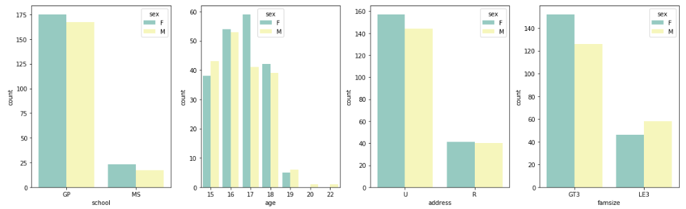

# Student Performance Project
A machine learning project looking into student performance.

Source: [UCI Machine Learning Repository](https://archive.ics.uci.edu/ml/datasets/Student+Performance)

## Section 0: Introduction

This is a classification and regression project looking into student performance in Portuguese and Maths classes using data from the UCI Machine Learning Repository. There are two datasets; one for each subject, and there is a crossover of 382 students between the two who can be identified by finding identical attricbutes.

### Dataset Information

This data approach student achievement in secondary education of two Portuguese schools. The data attributes include student grades, demographic, social and school related features) and it was collected by using school reports and questionnaires. Two datasets are provided regarding the performance in two distinct subjects: Mathematics (mat) and Portuguese language (por). In [Cortez and Silva, 2008], the two datasets were modeled under binary/five-level classification and regression tasks. Important note: the target attribute G3 has a strong correlation with attributes G2 and G1. This occurs because G3 is the final year grade (issued at the 3rd period), while G1 and G2 correspond to the 1st and 2nd period grades. It is more difficult to predict G3 without G2 and G1, but such prediction is much more useful (see paper source for more details).

